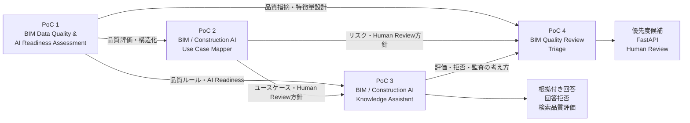

# BIM / Construction AI Portfolio

## 概要

このポートフォリオは、BIM導入支援・Revitコンサルティングの実務経験をベースに、建設業界におけるAI・データ活用を検証した4つの個人PoCをまとめたものです。

BIMデータの品質評価から、業務分類、ナレッジ検索、機械学習によるレビュー優先度候補の提示までを、一連の流れとして設計・実装しています。

```text
BIMデータ品質を評価する
↓
建設業務をAI・RAG・自動化・BI候補へ分類する
↓
知識を検索可能な形へ構造化する
↓
根拠付き回答・回答拒否・検索評価を行う
↓
BIM品質指摘をReviewTaskへ集約する
↓
ルールベースと機械学習でレビュー優先度候補を提示する
↓
Human Reviewへつなぐ
```

このポートフォリオでは、AIに処理させる仕組みだけでなく、評価、制約、監査性、人間による最終判断までを含めて設計しています。

---

## Portfolio Map



---

## PoC一覧

| PoC   | タイトル                                       | 主な目的                                   | 主な技術                                             |
| ----- | ------------------------------------------ | -------------------------------------- | ------------------------------------------------ |
| PoC 1 | BIM Data Quality & AI Readiness Assessment | BIMデータの品質とAI活用準備度を評価する                 | Python、pandas、Streamlit、pyRevit、pytest           |
| PoC 2 | BIM / Construction AI Use Case Mapper      | 建設業務をAI・RAG・自動化・BI・Human Review候補へ分類する | Python、CSV、Markdown、pytest                       |
| PoC 3 | BIM / Construction AI Knowledge Assistant  | ナレッジ検索、根拠付き回答、回答拒否、検索品質評価を行う           | Python、JSONL、キーワード検索、Ground Truth、pytest         |
| PoC 4 | BIM Quality Review Triage                  | BIM品質指摘を集約し、レビュー優先度候補を提示する             | scikit-learn、FastAPI、Pydantic、Docker、pytest、Ruff |

---

## PoC 1：BIM Data Quality & AI Readiness Assessment

Revit集計表などのBIMデータを、AI・データ分析へ利用する前段階として評価するPoCです。

### 主な実装

* Revit集計表TXTからCSVへの変換
* データクレンジング
* RuleIdベースの品質チェック
* QualityScore算出
* AI Readiness Score算出
* FixPriority教師データ・ラベル設計
* 生成AI向け構造化コンテキスト生成
* Fix Guide生成
* Streamlitによる簡易可視化
* pyRevitからのElementId・UniqueId出力検証
* pytestによる検証

### 位置づけ

AI Readiness Scoreは、業界標準や学習済みモデルによる推論値ではなく、BIMデータの下流利用可能性を説明するための独自ヒューリスティック指標です。

[GitHubリポジトリを見る](https://github.com/takahashi-365/bim-quality-poc)

---

## PoC 2：BIM / Construction AI Use Case Mapper

BIM・建設業務を整理し、適切なAI・DX活用方法を検討するためのPoCです。

### 主な実装

* 業務内容、入力、出力、判断種別の整理
* リスクとデータ構造化度の分類
* RAG候補の抽出
* 自動化候補の抽出
* BI候補の抽出
* ルールベースチェック候補の抽出
* Human Review対象の抽出
* Deep Dive対象の抽出
* 導入前協議用レポート生成
* pytestによる検証

「AIで実行できるか」だけではなく、「どの方式が適切か」「どこに人間判断が必要か」を整理しています。

[GitHubリポジトリを見る](https://github.com/takahashi-365/construction-ai-use-case-mapper)

---

## PoC 3：BIM / Construction AI Knowledge Assistant

PoC 1・PoC 2・PoC 3の知識を、検索可能なRAG-style Knowledge Documentsへ統合したローカルPoCです。

### 主な実装

* CSVからJSONL形式のKnowledge Documentsを生成
* chunk・metadata設計
* 簡易キーワードインデックス
* 40問に対するTop 3検索
* 参照元付き回答
* 回答可否判定
* 高リスク質問の回答拒否
* 根拠不足質問の回答拒否
* Ground Truthによる検索評価
* 検索失敗のエラー分析
* pytestによる126件の検証

### 評価結果

| 評価項目                   |     結果 |
| ---------------------- | -----: |
| Knowledge Documents    |    42件 |
| Sample Questions       |    40問 |
| Recall@3               | 0.9714 |
| MRR                    | 0.9190 |
| Answerability Accuracy | 1.0000 |
| No-answer Precision    | 1.0000 |
| No-answer Recall       | 1.0000 |

本PoCは、OpenAI API、Embedding、ベクトルデータベースを使用した本番RAGではありません。

RAGへ拡張可能なナレッジ構造、検索、回答拒否、安全設計、評価フローを検証したものです。

[GitHubリポジトリを見る](https://github.com/takahashi-365/bim-construction-ai-knowledge-assistant)

---

## PoC 4：BIM Quality Review Triage

BIM品質チェックで検出された複数の`QualityIssue`を、人間が確認する単位である`ReviewTask`へ集約し、レビュー優先度の候補を提示するPoCです。

```text
QualityIssue
↓
ReviewTaskへの集約
↓
Rule-based baseline
＋
Machine Learning
↓
High Priority Recommendation
↓
Human Review
```

### 主な実装

* QualityIssue・ReviewTaskのデータ契約
* シナリオベース合成データ生成
* 特徴量・ラベル設計
* ProjectId単位のデータ分割
* Rule-based baseline
* DummyClassifier
* LogisticRegression
* RandomForestClassifier
* モデル比較
* Decision Threshold分析
* 隔離したFinal Test
* FastAPI
* Request ID・構造化監査ログ
* 入力値・件数整合性検証
* Docker・Docker Compose
* Model Card
* 運用リスク・実案件導入条件の整理

### 採用モデル

| 項目                 | 内容                 |
| ------------------ | ------------------ |
| Model              | LogisticRegression |
| Model Version      | 0.1.0              |
| Decision Threshold | 0.50               |

Validation結果、説明のしやすさ、モデル構造の単純さを踏まえて、LogisticRegressionを採用しました。

### API

```text
GET  /health
GET  /model-info
POST /predict
```

推論結果には、予測値だけでなく、Request ID、モデル名、モデルバージョン、Decision Threshold、Human Review必須フラグを含めています。

### Human Review

APIは常に以下を返します。

```text
HumanDecisionRequired = true
ModelMustNotAutoApprove = true
```

モデルは、修正要否、設計承認、施工承認、法規適合、安全性、契約責任、納品可否などを自動確定しません。

### 評価上の注意

Final Testでは高い評価結果を確認していますが、使用したデータはシナリオベースの合成データです。

実案件でも同じ性能が得られることを示すものではなく、以下の評価工程が成立したことを確認した結果として扱っています。

* ProjectId単位のデータ分割
* ルールベースとの比較
* 複数モデル比較
* Decision Threshold決定
* 固定モデルによるFinal Test
* Human Reviewを前提としたAPI提供

[GitHubリポジトリを見る](https://github.com/takahashi-365/bim-quality-review-triage)

---

## 4つのPoCで示している能力

### BIM実務を理解したデータ設計

BIMデータの品質、欠損、ルール、修正優先度、要素識別情報を整理し、AI・データ分析へ接続する前段階を設計しています。

### AI・DX適用方法の整理

建設業務をRAG、BI、自動化、ルールベースチェック、Human Reviewなどへ分類しています。

### 検索・回答・回答拒否の設計

検索結果を表示するだけでなく、参照元、回答可否、高リスク・根拠不足時の回答拒否まで設計しています。

### 機械学習の比較・評価

ルールベースを基準として、複数モデル、Decision Threshold、Final Testを分離して評価しています。

### API・監査性の実装

固定したモデルをFastAPIで提供し、Request ID、構造化ログ、入力検証、モデル情報を実装しています。

### Human-in-the-loop

AIのみで完結させず、人間確認が必要な条件と、自動承認を禁止する範囲を明文化しています。

### 再現可能な成果物

README、設計文書、データ、ソースコード、テスト、Dockerを整理し、第三者が確認・実行できる構成にしています。

---

## 主な技術

### BIM・データ

* Revit
* BIM
* pyRevit
* Revit API
* Python
* pandas
* NumPy
* CSV
* JSON
* JSONL
* JSON Schema

### AI・機械学習

* scikit-learn
* LogisticRegression
* RandomForestClassifier
* DummyClassifier
* Rule-based baseline
* Ground Truth
* Decision Threshold分析

### API・実行環境

* FastAPI
* Pydantic
* Uvicorn
* Docker
* Docker Compose
* Streamlit

### 品質管理

* pytest
* Ruff
* Git
* GitHub
* Markdown
* Mermaid

---

## 現在の実装範囲

### 実装済み

* BIMデータ品質評価
* AI Readiness評価
* AI・DXユースケース分類
* RAG-style Knowledge Document設計
* キーワード検索
* 参照元付き回答
* 回答拒否
* 検索品質評価
* QualityIssueからReviewTaskへの集約
* ルールベースと機械学習の比較
* Decision Threshold分析
* FastAPI
* Request ID・監査ログ
* Docker・Docker Compose
* Human Review設計

### 未実装・今後の拡張

* 実案件データによる機械学習評価
* Azure AI Search
* Embedding検索
* Hybrid Search
* Azure OpenAIによる回答生成
* 認証・認可
* モデル監視
* データドリフト検知
* クラウドデプロイ
* 実務利用者向け画面

実装済みの範囲と、将来構想を区別して記載しています。

---

## 今後の成果物

* PoC 3 v2：Azure AI Search / Hybrid Retrieval Expansion
* PoC 5：BIM Information Delivery Checker
* 採用担当者向けOne-Pager
* ポートフォリオPDF
* 面接用説明資料

---

## 詳細資料

各PoCの背景、設計、評価結果、既知の制約については、以下を参照してください。

[Portfolio Overviewを見る](portfolio_overview.md)

より詳しい実装内容は、各PoCのGitHubリポジトリ内READMEと`docs`を参照してください。

---

## ポートフォリオとしての説明

BIM導入支援・Revitコンサルティングの実務経験をもとに、BIMデータと建設業務をAI・データ分析・RAG・機械学習へ接続する4つの個人PoCを作成しました。

PoC 1ではBIMデータ品質とAI活用準備度を評価し、PoC 2では建設業務をAI・DX活用候補へ分類しました。

PoC 3では、これらの知識を検索可能な形へ統合し、根拠付き回答、回答拒否、検索品質評価を実装しました。

PoC 4では、BIM品質指摘をReviewTaskへ集約し、ルールベースと機械学習によるレビュー優先度候補の提示、FastAPI、監査ログ、Dockerまで実装しました。

これらを通じて、BIM実務、業務整理、データ設計、AI適用判断、検索、安全設計、機械学習、API、評価、Human Reviewまでを一連で設計できることを示しています。

---

## GitHubリポジトリ

* [PoC 1：BIM Data Quality & AI Readiness Assessment](https://github.com/takahashi-365/bim-quality-poc)
* [PoC 2：BIM / Construction AI Use Case Mapper](https://github.com/takahashi-365/construction-ai-use-case-mapper)
* [PoC 3：BIM / Construction AI Knowledge Assistant](https://github.com/takahashi-365/bim-construction-ai-knowledge-assistant)
* [PoC 4：BIM Quality Review Triage](https://github.com/takahashi-365/bim-quality-review-triage)
