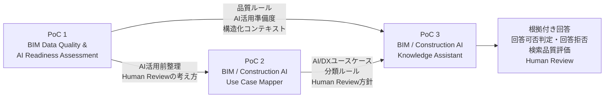

# BIM / Construction AI Portfolio

## 概要

このポートフォリオは、BIM実務経験をベースに、建設業界におけるAI・データ活用を検証した3つの個人PoCをまとめたものです。

単にAIツールを利用するのではなく、以下を一連の流れとして設計・実装しています。

```text
BIMデータを評価する
↓
建設業務を分類する
↓
AI・RAG・自動化・BIの適用候補を整理する
↓
知識を検索可能な形に構造化する
↓
根拠付きで回答する
↓
高リスク・根拠不足の場合は回答を拒否する
↓
検索品質と回答可否を定量評価する
↓
Human Reviewへつなぐ
```

このPortfolioで示したいのは、BIMの専門知識だけではなく、業務整理、データ設計、AI適用判断、検索・回答、安全設計、評価までを一連で設計できることです。

---

## Portfolio Map



---

## PoC一覧

| PoC | タイトル | 目的 | 主な実装 |
| --- | --- | --- | --- |
| PoC 1 | BIM Data Quality & AI Readiness Assessment | Revit/BIMデータの品質とAI活用準備度を評価する | Python、pandas、Streamlit、pytest |
| PoC 2 | BIM / Construction AI Use Case Mapper | BIM・建設業務をAI・RAG・自動化・BI・Human Reviewの候補へ分類する | Python、CSV、Markdown、pytest |
| PoC 3 | BIM / Construction AI Knowledge Assistant | BIM・建設AIナレッジを検索し、根拠付き回答、回答拒否、検索品質評価を行う | Python、CSV、JSONL、キーワード検索、ルールベース判定、pytest |

---

## 実装状態

各機能の現在の実装状態を、以下の4段階で整理しています。

| 状態 | 定義 |
| --- | --- |
| Implemented | コードがあり、実行・テスト可能 |
| Prototype | 限定的なMVP、教師データ設計、または初期検証まで実施 |
| Design Only | 設計文書や構成案のみ。動作する実装は未作成 |
| Planned | 今後の成果物で実装予定 |

| 項目 | 状態 | 対応PoC |
| --- | --- | --- |
| BIM品質ルールチェック | Implemented | PoC 1 |
| AI Readiness評価 | Implemented | PoC 1 |
| FixPriority教師データ・ラベル設計 | Prototype | PoC 1 |
| AI/DXユースケース分類 | Implemented | PoC 2 |
| Human Review設計 | Implemented | PoC 1・2・3 |
| RAG-style Knowledge Document設計 | Implemented | PoC 3 |
| キーワード検索 | Implemented | PoC 3 |
| 参照元付き回答 | Implemented | PoC 3 |
| 回答可否判定・回答拒否 | Implemented | PoC 3 |
| 検索品質・No-answer評価 | Implemented | PoC 3 |
| Azure AI Search | Design Only | PoC 3 |
| FixPriority機械学習モデル | Planned | PoC 4 |
| FastAPI | Planned | PoC 4 |
| 機械学習モデルの精度評価 | Planned | PoC 4 |

PoC 4は、BIM品質レビュー対象の優先度を機械学習で判定し、APIとして提供する次期成果物として計画しています。

```text
BIM Quality Review Priority Triage ML & API
```

現時点では未実装です。

---

## PoC 1：BIM Data Quality & AI Readiness Assessment

### 目的

Revit/BIMデータを、BI、データ分析、機械学習、生成AI、RAGなどへ活用する前段階として、データ品質とAI活用準備度を評価するPoCです。

BIMデータをそのままAIへ渡すのではなく、以下を確認できる構造を作成しました。

- 必須項目が入力されているか
- データが構造化されているか
- 品質ルールに違反していないか
- AIやデータ分析へ利用できる状態か
- 修正優先度をどのように判断するか
- 生成AIへ渡す構造化コンテキストを作成できるか

### 主な実装

- Revit集計表TXTの読み込みとCSV変換
- データクレンジング
- RuleIdベースの品質チェック
- QualityScore算出
- FixPriority教師データ・ラベル設計
- AI Readiness Score算出
- 生成AI向け構造化コンテキスト生成
- Fix Guide Markdown生成
- Streamlitによる簡易可視化
- pytestによる検証
- pyRevitからのElementId・UniqueId出力検証

### 技術的な位置づけ

AI Readiness Scoreは、業界標準や学習済みモデルによる推論結果ではありません。

BIMデータの下流利用可能性を説明するために、品質ルールとペナルティを組み合わせて設計した、PoC独自のヒューリスティック指標です。

FixPriorityについては、現時点では機械学習モデルを実装していません。将来の優先度分類モデル構築に向けた教師データ・ラベル設計として位置づけています。

### GitHub

[GitHubリポジトリを見る](https://github.com/takahashi-365/bim-quality-poc)

---

## PoC 2：BIM / Construction AI Use Case Mapper

### 目的

BIM・建設業務をAI/DX活用候補として分類し、AI導入前の協議材料を生成するPoCです。

「AIで自動化できるか」だけで判断せず、以下の観点から業務を整理しました。

- RAGに適しているか
- BI・可視化に適しているか
- 自動化に適しているか
- ルールベースチェックに適しているか
- Human Reviewが必要か
- 深掘り検討が必要か
- AI/DX導入前に何を協議すべきか

### 主な実装

- BIM・建設業務ユースケースのサンプル整理
- 業務内容、入力データ、出力データの整理
- 判断種別、リスク、データ構造化度の整理
- AI/DX活用パターン分類
- RecommendedApproachの付与
- HumanReviewRequiredの付与
- DeepDiveRequiredの付与
- RAG・自動化・BI候補の派生出力
- 協議用レポート生成
- pytestによる検証

### GitHub

[GitHubリポジトリを見る](https://github.com/takahashi-365/construction-ai-use-case-mapper)

---

## PoC 3：BIM / Construction AI Knowledge Assistant

### 目的

PoC 1のBIMデータ品質評価ナレッジ、PoC 2の建設AI/DXユースケース分類ナレッジ、PoC 3自身の回答方針・Human Review方針・制約を、検索可能な形へ統合したローカルのRAG-style Knowledge Assistantです。

単に検索結果を表示するだけでなく、以下までを検証しています。

- 質問に関連する文書をTop 3で検索する
- 参照元を示した根拠付き回答を生成する
- 質問へ回答できるかを判定する
- 高リスク領域では回答を拒否する
- ナレッジに根拠がない場合は回答を拒否する
- 回答拒否時にHuman Reviewを要求する
- Ground Truthを使って検索品質を定量評価する
- 回答可否判定と回答拒否の性能を評価する
- 検索失敗をエラー分析として記録する

### 主な実装

- PoC 1・PoC 2・PoC 3のナレッジCSV作成
- RAG-style Knowledge Document形式のJSONL生成
- chunk・metadata設計
- RuleId・UseCaseIdの付与
- HumanReviewRequired・DeepDiveRequiredの付与
- 簡易キーワードインデックス生成
- 40問のサンプル質問に対するTop 3検索
- Ground Truthデータセット作成
- Recall@3・MRRの算出
- Answerability Accuracyの算出
- No-answer Precision・Recallの算出
- 高リスク質問の回答拒否
- 根拠不足質問の回答拒否
- 参照元付き回答Markdown生成
- 評価集計JSON・質問別評価CSV生成
- 検索エラー分析
- pytestによる126件の検証

### 回答を拒否する対象

以下のような質問には、検索結果が存在する場合でも通常回答を生成せず、Human Reviewへつなぎます。

- 法令適合性の最終判断
- 構造計算・構造安全性の最終判断
- 施工方法・施工安全性の最終判断
- 契約責任の決定
- ナレッジに必要な根拠が存在しない質問

この設計により、AIへ回答させる仕組みだけではなく、AIへ回答させない条件も明文化しています。

### 評価結果

| 評価項目 | 結果 |
| --- | ---: |
| Knowledge Documents | 42件 |
| PoC 1 Documents | 16件 |
| PoC 2 Documents | 22件 |
| PoC 3 Documents | 4件 |
| Sample Questions | 40問 |
| Answerable Questions | 35問 |
| No-answer Questions | 5問 |
| Recall@3 | 0.9714 |
| MRR | 0.9190 |
| Answerability Accuracy | 1.0000 |
| No-answer Precision | 1.0000 |
| No-answer Recall | 1.0000 |
| pytest | 126 passed |

回答可能質問35問のうち34問では、期待文書をTop 3以内に取得しました。

1問は期待文書をTop 3以内に取得できず、簡易キーワード検索の既知制約としてエラー分析に記録しています。

特定の質問だけに適合する修正は行わず、今後のBM25、Embedding、Hybrid Searchとの比較対象として残しています。

### 技術的な位置づけ

PoC 3は、本番環境のLLMベースRAGではありません。

現在の実装は以下です。

- ローカルPython
- CSV・JSONL・JSON
- 簡易キーワード検索
- テンプレートベース回答
- ルールベースの回答可否判定
- Ground Truthによる評価
- pytestによる検証

以下は使用していません。

- OpenAI API
- Azure OpenAI
- Azure AI Search
- Embedding
- ベクトルデータベース
- LLMによる自由生成

そのため、本PoCは「高度なRAGシステム」ではなく、RAGへ拡張可能なナレッジ構造、検索・回答・安全設計、評価フローを検証したものとして位置づけています。

### GitHub

[GitHubリポジトリを見る](https://github.com/takahashi-365/bim-construction-ai-knowledge-assistant)

---

## 3つのPoCで示したいこと

### 1. BIM実務を理解した上で、AI活用前のデータ整備ができる

BIMデータの品質、欠損、構造、ルール、修正優先度を整理し、AIやデータ分析で扱う前段階を設計しています。

### 2. 建設業務をAI/DX活用候補として分類できる

建設業務をRAG、BI、自動化、ルールベースチェック、Human Review、深掘り対象へ分類し、AI導入前の協議材料へ変換しています。

### 3. 蓄積した知識を検索・説明可能な形へ構造化できる

PoC 1・PoC 2・PoC 3の知識をRAG-style Knowledge Documentsとして統合し、参照元付きで回答できる構造を作成しています。

### 4. AIに回答させない条件を設計できる

法令、構造、施工安全、契約責任、根拠不足など、AIだけで最終判断すべきでない領域を回答拒否対象とし、Human Reviewへつなげています。

### 5. PoCを定量評価し、改善点を説明できる

Ground Truth、Recall@3、MRR、Answerability Accuracy、No-answer Precision・Recallを用いて、検索品質と回答可否判定を評価しています。

検索失敗も隠さず記録し、次の改善対象として整理しています。

### 6. GitHub上で再現・説明可能な成果物を作成できる

各PoCでは、README、設計文書、input、output、src、testsを整理し、pytestによる検証結果を含めて公開しています。

---

## 実装済みの範囲と今後の拡張

### 実装済み

- BIMデータ品質評価
- AI Readiness評価
- BIM・建設業務ユースケース分類
- RAG-style Knowledge Document設計
- ローカルキーワード検索
- 参照元付き回答
- ルールベース回答可否判定
- 高リスク・根拠不足時の回答拒否
- Ground Truthによる検索評価
- 回答拒否性能の評価
- Human Review設計
- pytestによる検証

### 今後の拡張候補

- PoC 4：BIM Quality Review Priority Triage ML & API
- COBie・FMナレッジの追加
- BIM実行計画・BEP関連ナレッジの追加
- BM25検索との比較
- Embedding検索との比較
- Hybrid Search
- Azure AI Searchとの接続
- Azure OpenAIによる回答生成
- Streamlit UI
- Power BI可視化
- pyRevit・Revit API連携
- 実務データを用いた評価拡張

---

## 使用技術

- Revit / BIM
- Python
- pandas
- CSV
- JSON / JSONL
- Markdown
- Streamlit
- pytest
- Mermaid
- Git / GitHub
- Power BI
- pyRevit / Revit API

---

## 詳細資料

PoC 1〜3の背景、実装内容、評価結果、既知の制約を含む詳しい説明は、以下を参照してください。

[Portfolio Overviewを見る](portfolio_overview.md)

---

## ポートフォリオとしての説明

BIM導入支援・Revitコンサルティングの実務経験をもとに、BIMデータと建設業務をAI・データ分析・RAG活用へ接続するための個人PoCを作成しています。

PoC 1では、Revit/BIMデータの品質評価とAI活用準備度評価を実装しました。

PoC 2では、BIM・建設業務をAI、RAG、自動化、BI、Human Reviewなどの活用候補へ分類する仕組みを作成しました。

PoC 3では、これらの知識を検索可能な形へ統合し、参照元付き回答に加えて、高リスク・根拠不足時の回答拒否、Ground Truthによる検索品質評価、回答可否判定の評価までを実装しました。

次期成果物として、BIM品質レビュー対象の優先度を機械学習で判定し、FastAPIで提供するPoC 4を計画しています。PoC 4は現時点では未実装です。

これらのPoCを通じて、BIM実務、業務整理、データ設計、AI適用判断、検索・回答、安全設計、定量評価、Human Reviewまでを一連の流れとして整理しています。