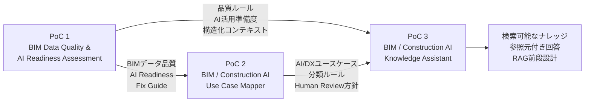

# BIM / Construction AI Portfolio

## 概要

このポートフォリオは、BIM実務経験をベースに、建設業界におけるAI・データ活用・生成AI活用を検証した個人PoCの一覧です。

単なるAIツール利用ではなく、BIMデータや建設業務をAI・機械学習・生成AIで扱える状態に整えるための、データ品質評価、業務分類、ナレッジ設計、RAG前段設計をテーマにしています。

全体の流れは以下です。

```text
PoC 1：
BIMデータがAI活用に適しているかを評価する

PoC 2：
BIM・建設業務がどのAI/DX活用に適しているかを分類する

PoC 3：
PoC 1・PoC 2の成果物を検索し、根拠付きで説明する
```

```text
BIMデータ品質評価
↓
AI活用準備度評価
↓
建設業務ユースケース分類
↓
ナレッジ検索・根拠付き回答
```

---

## Portfolio Map



---

## PoC一覧

| PoC   | タイトル                                       | 目的                            | 主な技術                                      |
| ----- | ------------------------------------------ | ----------------------------- | ----------------------------------------- |
| PoC 1 | BIM Data Quality & AI Readiness Assessment | Revit/BIMデータの品質とAI活用準備度を評価する  | Python, pandas, Streamlit, pytest         |
| PoC 2 | BIM / Construction AI Use Case Mapper      | BIM・建設業務をAI/DX活用候補に分類する       | Python, CSV, Markdown, pytest             |
| PoC 3 | BIM / Construction AI Knowledge Assistant  | PoC 1・PoC 2の成果物を検索し、根拠付きで説明する | Python, JSONL, RAG-style document, pytest |

---

# PoC 1

# BIM Data Quality & AI Readiness Assessment

## 目的

Revit/BIMデータを、BI、データ分析、機械学習、生成AI、RAGなどに活用する前段階として、データ品質とAI活用準備度を評価するPoCです。

BIMモデルやRevit集計表の情報をそのままAIに使うのではなく、まず以下を確認することを目的としています。

* 必須項目が入っているか
* データが構造化されているか
* 品質ルールに違反していないか
* AIやデータ分析に使える状態か
* 修正優先度をどう判断するか
* 生成AIに渡すための構造化コンテキストを作れるか

---

## 実装内容

主な実装内容は以下です。

* Revit集計表TXTの読み込み
* CSV変換
* データクレンジング
* RuleIdベースの品質チェック
* QualityScore算出
* 特徴量データセット作成
* FixPriority分類プロトタイプ
* AI Readiness Score算出
* 生成AI向け構造化コンテキスト生成
* Fix Guide Markdown生成
* Streamlitによる簡易可視化
* pytestによる検証

---

## 技術的ポイント

このPoCでは、AIモデルそのものの精度追求ではなく、BIMデータをAIやデータ分析で扱える状態に整えることを重視しています。

特に以下を意識しています。

* BIMデータ品質ルールの明文化
* RuleIdによる品質チェック
* AI活用前のデータ整備
* 生成AI向けの構造化コンテキスト設計
* 修正優先度判断の初期設計

---

## GitHub

```text
https://github.com/takahashi-365/bim-quality-poc
```

---

# PoC 2

# BIM / Construction AI Use Case Mapper

## 目的

BIM・建設業務を、AI/DX活用候補として分類し、導入前の協議材料を生成するPoCです。

建設業務にAIを適用する際、すぐに「AIで自動化できるか」を判断するのではなく、以下の観点で整理することを目的としています。

* その業務はRAGに向いているか
* BIや可視化に向いているか
* 自動化に向いているか
* ルールベースチェックに向いているか
* 人間レビューが必要か
* 深掘り検討が必要か
* AI/DX導入前にどのような協議が必要か

---

## 実装内容

主な実装内容は以下です。

* BIM・建設業務ユースケースのサンプル整理
* 業務内容、入力データ、出力データの整理
* 判断種別、リスク、データ構造化度の整理
* AI/DX活用パターン分類
* RecommendedApproachの付与
* HumanReviewRequiredの付与
* DeepDiveRequiredの付与
* DXサービス候補の抽出
* 協議用レポート生成
* pytestによる検証

---

## 技術的ポイント

このPoCでは、建設業務をAI活用に接続するための前段整理を重視しています。

特に以下を意識しています。

* AI導入前の業務分類
* RAG、BI、自動化、人間レビューの切り分け
* 建設業務におけるAI/DX活用可能性の整理
* 協議用アウトプットの生成
* AIが最終判断しない前提の設計

---

## GitHub

```text
https://github.com/takahashi-365/bim-construction-ai-use-case-mapper
```

---

# PoC 3

# BIM / Construction AI Knowledge Assistant

## 目的

PoC 1で作成したBIMデータ品質評価ナレッジと、PoC 2で作成した建設AI/DXユースケース分類ナレッジを検索可能な形に整理し、質問に対して参照元付きで回答するローカルRAG-styleナレッジアシスタントのPoCです。

PoC 1・PoC 2の成果物を、単なる個別ファイルとして終わらせるのではなく、検索・参照・説明できるナレッジとして再利用することを目的としています。

---

## 実装内容

主な実装内容は以下です。

* PoC 1・PoC 2のサンプルナレッジCSV作成
* CSVからRAG-style document形式のJSONL生成
* metadata設計
* RuleId / UseCaseIdの付与
* HumanReviewRequired / DeepDiveRequiredの付与
* 簡易キーワードインデックス生成
* サンプル質問35問に対する検索処理
* Top 3検索結果のCSV出力
* 参照元付きの根拠付き回答Markdown生成
* README日本語化
* Mermaid図による処理フロー可視化
* pytestによる90件の検証

---

## 技術的ポイント

このPoCでは、本番RAG構成そのものではなく、RAGに進む前段階として以下を検証しています。

* RAG-style document設計
* chunk設計
* metadata設計
* simple keyword index
* Grounded Answer形式
* Referenced Sourcesの出力
* Human Review方針
* No-result検出
* 出力成果物のpytest検証

このPoCでは、Azure AI Search、OpenAI API、Embedding、ベクトルDBは使用していません。
まずはローカル環境で、RAG前段のdocument設計、検索、回答生成、検証の流れを確認しています。

---

## 成果

主な成果は以下です。

* `rag_documents_v001.jsonl`：38 documents
* `rag_index_v001.json`：simple keyword index
* `retrieval_results_v001.csv`：35 questions / 105 retrieval result rows
* `sample_answers_v001.md`：35問分の根拠付き回答
* pytest：90 passed
* GitHub公開済み
* README日本語メイン化
* Mermaid図追加済み

---

## GitHub

```text
https://github.com/takahashi-365/bim-construction-ai-knowledge-assistant
```

---

# 3つのPoCで示したいこと

## 1. BIM実務を理解した上で、AI活用前のデータ整備ができる

BIMデータをそのままAIに渡すのではなく、品質、構造、欠損、ルール、修正優先度を確認する流れを作成しています。

---

## 2. 建設業務をAI/DX活用候補として分類できる

建設業務を、RAG、BI、自動化、ルールベースチェック、人間レビュー、深掘り対象に分類し、AI/DX導入前の協議材料に変換しています。

---

## 3. 蓄積した知識を検索・説明可能なナレッジにできる

PoC 1・PoC 2の成果物を、RAG-style documentとして整理し、検索結果に基づいて参照元付きで回答する構造を作成しています。

---

## 4. PoCをGitHub上で再現・説明可能な成果物にできる

各PoCでは、README、設計docs、input、output、src、testsを整理し、pytestによる検証結果を含めて公開しています。

---

# 今後の拡張方針

今後は、以下の方向に拡張予定です。

* Revit API / pyRevit連携
* 実務データを用いた品質ルール拡張
* 修正優先度分類の教師データ整備
* COBie / FMナレッジの追加
* BIM実行計画・BEP関連ナレッジの追加
* Azure AI SearchによるRAG構成
* Azure OpenAIによる回答生成
* Streamlit UIの追加
* Power BI可視化との接続
* 建設業務トリアージとの連携

---

# 使用技術

* Revit
* BIM
* Python
* pandas
* CSV
* JSON / JSONL
* Markdown
* Streamlit
* pytest
* Mermaid
* Git / GitHub
* Power BI
* pyRevit / Revit API連携検証

---

# ポートフォリオとしての説明文

BIM導入支援・Revitコンサルティングの実務経験をもとに、BIMデータをAI・データ分析・生成AI活用へ接続するための個人PoCを作成しています。

PoC 1では、Revit/BIMデータの品質評価とAI活用準備度評価を実装しました。
PoC 2では、BIM・建設業務をAI/DX活用候補に分類する仕組みを作成しました。
PoC 3では、PoC 1・PoC 2の成果物を検索可能なナレッジとして整理し、質問に対して参照元付きで回答するRAG-styleナレッジアシスタントを構築しました。

これらのPoCを通じて、BIMデータ品質評価、AI/DXユースケース分類、RAG前段設計、根拠付き回答生成、pytestによる検証までを一連の流れとして整理しています。
