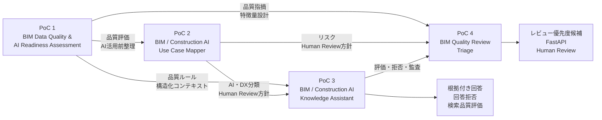

# BIM / Construction AI Portfolio Overview

## 1. Portfolioの概要

このPortfolioは、BIM導入支援・Revitコンサルティングの実務経験をベースに、建設業界におけるAI・データ活用を検証した4つの個人PoCをまとめたものです。

BIMデータの品質評価から、建設業務の分類、ナレッジ検索、機械学習によるレビュー優先度候補の提示までを、一連の流れとして設計・実装しています。

```text
BIMデータの品質を評価する
↓
建設業務をAI・DX活用候補へ分類する
↓
知識を検索可能な形へ構造化する
↓
根拠付き回答・回答拒否・検索評価を行う
↓
BIM品質指摘を人間が確認する単位へ集約する
↓
ルールベースと機械学習でレビュー優先度候補を提示する
↓
FastAPIで提供する
↓
Human Reviewへつなぐ
```

単にAIを利用するのではなく、以下を一連で設計できることを示しています。

* BIM実務を踏まえたデータ設計
* データ品質評価
* AI・DX適用判断
* ナレッジ構造化
* 検索・回答拒否設計
* 機械学習モデルの比較・評価
* API実装
* 監査性
* Human-in-the-loop
* 実運用前の制約・リスク整理

---

## 2. Portfolio全体の構成

### PoC 1

```text
BIM Data Quality & AI Readiness Assessment
```

BIMデータの品質を確認し、AI・データ分析へ利用できる状態かを評価します。

### PoC 2

```text
BIM / Construction AI Use Case Mapper
```

BIM・建設業務を整理し、AI、RAG、自動化、BI、ルールベースチェック、Human Reviewなどの候補へ分類します。

### PoC 3

```text
BIM / Construction AI Knowledge Assistant
```

PoC 1・PoC 2・PoC 3の知識を検索可能な形へ統合し、根拠付き回答、回答拒否、検索品質評価を行います。

### PoC 4

```text
BIM Quality Review Triage
```

BIM品質指摘を人間が確認する単位へ集約し、ルールベースと機械学習でレビュー優先度候補を提示します。

---

## 3. Portfolio Map



---

## 4. PoC一覧

| PoC   | タイトル                                       | 主な目的                                   | 主な技術・方式                                          |
| ----- | ------------------------------------------ | -------------------------------------- | ------------------------------------------------ |
| PoC 1 | BIM Data Quality & AI Readiness Assessment | BIMデータの品質とAI活用準備度を評価する                 | Python、pandas、Streamlit、pytest、pyRevit           |
| PoC 2 | BIM / Construction AI Use Case Mapper      | 建設業務をAI・RAG・自動化・BI・Human Review候補へ分類する | Python、CSV、Markdown、pytest                       |
| PoC 3 | BIM / Construction AI Knowledge Assistant  | ナレッジ検索、根拠付き回答、回答拒否、検索品質評価を行う           | Python、JSONL、キーワード検索、Ground Truth、pytest         |
| PoC 4 | BIM Quality Review Triage                  | BIM品質指摘をReviewTaskへ集約し、レビュー優先度候補を提示する  | scikit-learn、FastAPI、Pydantic、Docker、pytest、Ruff |

---

## 5. 実装状態

| 項目                            | 状態          | 対応PoC       | 補足                                    |
| ----------------------------- | ----------- | ----------- | ------------------------------------- |
| BIM品質ルールチェック                  | Implemented | PoC 1       | RuleIdベースで判定                          |
| AI Readiness評価                | Implemented | PoC 1       | 独自ヒューリスティック指標                         |
| FixPriority教師データ・ラベル設計        | Prototype   | PoC 1       | PoC 1ではML未実装                          |
| AI・DXユースケース分類                 | Implemented | PoC 2       | AI、RAG、BI、自動化などへ分類                    |
| Human Review設計                | Implemented | PoC 1・2・3・4 | 人間確認条件を明示                             |
| RAG-style Knowledge Documents | Implemented | PoC 3       | CSVからJSONLへ変換                         |
| キーワード検索                       | Implemented | PoC 3       | ローカル簡易検索Baseline                      |
| 参照元付き回答                       | Implemented | PoC 3       | テンプレートベース                             |
| 回答可否判定・回答拒否                   | Implemented | PoC 3       | 高リスク・根拠不足を拒否                          |
| 検索品質・No-answer評価              | Implemented | PoC 3       | Recall@3、MRR等を使用                      |
| QualityIssue・ReviewTaskデータ契約  | Implemented | PoC 4       | JSON Schemaで定義                        |
| ReviewTask集約                  | Implemented | PoC 4       | 複数指摘を確認単位へ集約                          |
| 合成データ生成                       | Implemented | PoC 4       | Scenario Catalogから生成                  |
| ProjectId単位のデータ分割             | Implemented | PoC 4       | Project間の独立性を考慮                       |
| Rule-based baseline           | Implemented | PoC 4       | MLとの比較基準                              |
| 機械学習モデル比較                     | Implemented | PoC 4       | Dummy、LogisticRegression、RandomForest |
| Decision Threshold分析          | Implemented | PoC 4       | Validationで0.50を選定                    |
| 隔離したFinal Test                | Implemented | PoC 4       | モデル選択から分離                             |
| FastAPI                       | Implemented | PoC 4       | health、model-info、predict             |
| Request ID・監査ログ               | Implemented | PoC 4       | 推論処理を追跡可能                             |
| Docker・Docker Compose         | Implemented | PoC 4       | ローカル再現環境                              |
| Model Card・運用リスク資料            | Implemented | PoC 4       | 制約・導入条件を整理                            |
| Azure AI Search               | Design Only | PoC 3       | PoC 3 v2で拡張予定                         |
| Embedding・Hybrid Search       | Planned     | PoC 3 v2    | 現時点では未実装                              |
| 実案件データによるML評価                 | Planned     | PoC 4       | 現在は合成データのみ                            |

---

## 6. PoC 1：BIM Data Quality & AI Readiness Assessment

### 6.1 背景

BIMモデルやRevit集計表のデータは、そのままAI、データ分析、BI、RAGなどへ利用できるとは限りません。

欠損、表記揺れ、分類の不統一、必要項目の不足がある場合、後工程での分析やAI活用に影響します。

PoC 1では、BIMデータをAIへ接続する前段階として、データ品質とAI活用準備度を評価する仕組みを作成しました。

### 6.2 主な目的

* 必須項目、欠損、不整合を確認する
* BIMデータ品質ルールを明文化する
* RuleId単位で品質違反を記録する
* データ品質をスコア化する
* AI・データ分析へ利用できる状態かを評価する
* AI向け構造化コンテキストを作成する
* Human Review対象を明示する

### 6.3 主な実装

* Revit集計表TXTからCSVへの変換
* データクレンジング
* RuleIdベースの品質チェック
* QualityScore算出
* FixPriority教師データ・ラベル設計
* AI Readiness Score算出
* AI向け構造化コンテキスト生成
* Fix Guide生成
* Streamlitによる簡易可視化
* pyRevitからのElementId・UniqueId出力検証
* pytestによる検証

### 6.4 技術的な位置づけ

AI Readiness Scoreは、業界標準や学習済みモデルによる推論値ではありません。

BIMデータの下流利用可能性を説明するため、品質ルールとペナルティを組み合わせたPoC独自のヒューリスティック指標です。

FixPriorityは、PoC 1では機械学習による推論を行わず、将来の優先度分類に向けた教師データ・ラベル設計として位置づけています。

### 6.5 PoC 4との関係

PoC 1ではBIMデータ品質の問題を検出し、PoC 4では複数の品質指摘をReviewTaskへ集約して、レビュー順序の候補を提示しています。

```text
PoC 1
BIMデータ品質の問題を検出する
↓
PoC 4
品質指摘を集約し、レビュー順序候補を提示する
```

### 6.6 GitHub

[PoC 1のGitHubリポジトリを見る](https://github.com/takahashi-365/bim-quality-poc)

---

## 7. PoC 2：BIM / Construction AI Use Case Mapper

### 7.1 背景

建設業務へAIを適用する場合、すべての業務を生成AIや自動化の対象にできるわけではありません。

業務ごとに、RAG、BI、ルールベースチェック、自動化、人間レビューなど、適切な方式が異なります。

また、法令、契約、安全、設計判断を含む業務では、AIだけで最終判断させるべきではありません。

### 7.2 主な目的

* BIM・建設業務を構造化する
* 入力、出力、判断種別を整理する
* データの構造化度とリスクを整理する
* RAG、BI、自動化候補を抽出する
* ルールベースチェック候補を抽出する
* Human Review対象を抽出する
* AI・DX導入前の協議材料を生成する

### 7.3 主な実装

* 建設業務ユースケースのサンプルデータ作成
* 業務内容、入力、出力の整理
* 判断種別、リスク、構造化度の整理
* RecommendedApproachの付与
* HumanReviewRequiredの付与
* DeepDiveRequiredの付与
* RAG、Automation、BI候補CSVの生成
* Human Review候補CSVの生成
* 協議用レポート生成
* pytestによる検証

### 7.4 技術的な位置づけ

PoC 2では、「AIでできるか」だけではなく、「どの方式が適切か」「どこに人間判断が必要か」を整理しています。

```text
AI
RAG
Automation
BI
Rule-based Check
Human Review
Deep Dive
```

### 7.5 PoC 4との関係

PoC 2で整理した以下の考え方を、PoC 4にも引き継いでいます。

* 高リスク業務をAIだけで確定しない
* 自動化可能性と自動承認を分ける
* AI出力を候補提示として扱う
* Human Reviewを必須とする
* 導入前に責任分界を整理する

### 7.6 GitHub

[PoC 2のGitHubリポジトリを見る](https://github.com/takahashi-365/construction-ai-use-case-mapper)

---

## 8. PoC 3：BIM / Construction AI Knowledge Assistant

### 8.1 背景

PoC 1とPoC 2で作成したBIM品質ルール、AI Readiness、AI・DXユースケース、Human Review方針などの知識は、CSVやMarkdownへ分散していました。

PoC 3では、これらに回答方針、Human Review方針、制約を加え、RAG-style Knowledge Documentsとして統合しました。

### 8.2 主な目的

* PoC 1・PoC 2・PoC 3の知識を検索可能にする
* 関連文書をTop 3で取得する
* 参照元を示した回答を生成する
* 回答できる質問かを判定する
* 高リスク・根拠不足の場合は回答しない
* 回答拒否時にHuman Reviewへつなぐ
* Ground Truthで検索品質を評価する
* 検索失敗を記録する

### 8.3 ナレッジ構成

| ナレッジ種別          |  件数 |
| --------------- | --: |
| PoC 1 Documents | 16件 |
| PoC 2 Documents | 22件 |
| PoC 3 Documents |  4件 |
| 合計              | 42件 |

PoC 3自身の知識：

| DocumentId  | 内容             |
| ----------- | -------------- |
| P3-SUM-W001 | ワークフロー概要       |
| P3-POL-A001 | 回答方針           |
| P3-POL-H001 | Human Review方針 |
| P3-LIM-L001 | 制約事項           |

### 8.4 主な実装

* ナレッジCSV作成
* JSONL形式のKnowledge Documents生成
* chunk・metadata設計
* RuleId・UseCaseIdの付与
* 簡易キーワードインデックス作成
* 40問に対するTop 3検索
* Ground Truthデータセット作成
* Recall@3・MRR算出
* 回答可否判定
* 高リスク・根拠不足質問の回答拒否
* 参照元付き回答生成
* 質問別評価・検索エラー分析
* pytestによる126件の検証

### 8.5 回答拒否設計

以下の場合は通常回答を生成せず、Human Reviewを要求します。

#### 高リスク領域

* 法令適合性の最終判断
* 構造安全性の最終判断
* 施工方法・施工安全性の最終判断
* 契約責任の決定

#### 根拠不足

* 必要な情報がKnowledge Documentsにない
* 取得文書が回答根拠として不十分

```text
NO_ANSWER_HIGH_RISK
NO_ANSWER_NO_EVIDENCE
```

### 8.6 評価結果

| 評価項目                   |         結果 |
| ---------------------- | ---------: |
| Knowledge Documents    |        42件 |
| Sample Questions       |        40問 |
| Answerable Questions   |        35問 |
| No-answer Questions    |         5問 |
| Recall@3               |     0.9714 |
| MRR                    |     0.9190 |
| Answerability Accuracy |     1.0000 |
| No-answer Precision    |     1.0000 |
| No-answer Recall       |     1.0000 |
| pytest                 | 126 passed |

回答可能質問35問のうち34問で、期待文書をTop 3以内に取得しました。

回答拒否対象5問は、すべて想定どおり回答拒否となりました。

### 8.7 既知の検索失敗

1件の検索失敗があります。

```text
QuestionId:
Q027

ExpectedDocumentId:
P3-SUM-W001
```

特定質問だけに適合する修正は行わず、簡易キーワード検索のBaseline制約として記録しています。

改善候補：

* 検索対象テキストの再設計
* トークン正規化
* BM25
* Embedding検索
* Hybrid Search

### 8.8 技術的な位置づけ

PoC 3は、本番環境のLLMベースRAGではありません。

現在の構成：

* ローカルPython
* CSV・JSONL・JSON
* 簡易キーワード検索
* テンプレートベース回答
* ルールベース回答可否判定
* Ground Truth評価

未使用：

* OpenAI API
* Azure OpenAI
* Azure AI Search
* Embedding
* ベクトルデータベース
* LLMによる自由生成

本PoCは、RAGへ拡張可能なナレッジ構造、検索、回答拒否、安全設計、評価フローを検証したものです。

### 8.9 PoC 4との関係

PoC 3では、AIが回答してよいかを判定し、高リスク・根拠不足の場合は回答を拒否します。

PoC 4では、AIの予測を自動承認に使用せず、人間がレビュー順序を検討するための候補として提示します。

### 8.10 GitHub

[PoC 3のGitHubリポジトリを見る](https://github.com/takahashi-365/bim-construction-ai-knowledge-assistant)

---

## 9. PoC 4：BIM Quality Review Triage

### 9.1 背景と目的

BIM品質チェックでは、1つの要素や原因に対して複数の品質指摘が発生する場合があります。

品質指摘を1件ずつ確認すると、同じ問題を重複して確認したり、重要な指摘が大量の結果に埋もれたりする可能性があります。

PoC 4では、複数の`QualityIssue`を、人間が確認する単位である`ReviewTask`へ集約し、レビュー優先度候補を提示する仕組みを作成しました。

```text
QualityIssue
↓
ReviewTaskへの集約
↓
Rule-based Baseline
＋
Machine Learning
↓
High Priority Recommendation
↓
FastAPI
↓
Human Review
```

モデルは修正要否や設計承認を自動決定せず、人間がどのReviewTaskから確認するか、その候補を提示することに限定しています。

### 9.2 主な実装

* QualityIssue・ReviewTaskのJSON Schema
* Golden Scenario
* QualityIssueからReviewTaskへの集約
* Scenario Catalog
* シナリオベース合成データ生成
* 特徴量・ラベル設計
* ProjectId単位のTrain・Validation・Final Test分割
* Rule-based baseline
* DummyClassifier
* LogisticRegression
* RandomForestClassifier
* モデル比較
* Decision Threshold分析
* 隔離したFinal Test
* Model Manifest
* FastAPI
* Pydantic入力検証
* Request ID・構造化監査ログ
* Docker・Docker Compose
* Model Card
* 運用リスク・実案件導入条件
* pytest・Ruff

### 9.3 データと評価設計

実案件データではなく、Scenario Catalogに基づく合成データを使用しています。

主なシナリオ観点：

* Severity
* Issue数
* Rule数
* 影響範囲
* 修正工数
* 下流工程への影響
* 複数分野への影響
* エスカレーション要因
* 軽微な単一問題

データはReviewTask単位でランダムに分割せず、`ProjectId`単位で以下へ分割しています。

```text
Train
Validation
Final Test
```

同一Projectのデータが複数Splitへ混在することを避け、プロジェクト固有の傾向が学習と評価の双方へ入らないようにしています。

### 9.4 モデル比較と採用モデル

比較した方法：

```text
Rule-based baseline
DummyClassifier
LogisticRegression
RandomForestClassifier
```

採用モデル：

| 項目                 | 内容                 |
| ------------------ | ------------------ |
| Model              | LogisticRegression |
| Model Version      | 0.1.0              |
| Decision Threshold | 0.50               |

採用理由：

* Validation上でFalse Positiveが0件
* Validation上でFalse Negativeが0件
* RandomForestより構造が単純
* 係数から全体傾向を説明しやすい
* 固定Baselineモデルとして扱いやすい

この結果は、現在の合成データと評価条件における選択です。

実案件で常に最適なモデルであることを意味しません。

### 9.5 Decision ThresholdとFinal Test

Validationで0.30から0.70までの閾値を比較しました。

0.30から0.50までは評価結果が同一でしたが、0.55以上ではHigh Priorityの1件がFalse Negativeになりました。

重要なReviewTaskを見逃さないことを優先し、`0.50`を選択しました。

Final Testは、モデル選択やThreshold調整には使用せず、最終評価まで隔離しました。

| 評価項目           |   結果 |
| -------------- | ---: |
| Record Count   |  140 |
| True Positive  |   50 |
| True Negative  |   90 |
| False Positive |    0 |
| False Negative |    0 |
| Precision      | 1.00 |
| Recall         | 1.00 |
| F1             | 1.00 |
| ROC-AUC        | 1.00 |

これは合成データ上の評価結果です。

適切な解釈：

```text
ProjectId単位の分割、
モデル比較、
閾値決定、
固定モデル、
隔離したFinal Testという
評価工程が成立した
```

不適切な解釈：

```text
実案件でも100%の精度で
優先度を判定できる
```

### 9.6 FastAPI・監査性・Docker

実装済みエンドポイント：

```text
GET  /health
GET  /model-info
POST /predict
```

予測レスポンスには、以下を含みます。

* ReviewTaskId
* RequestId
* 予測結果
* 予測確率
* Decision Threshold
* ModelName
* ModelVersion
* HumanDecisionRequired
* ModelMustNotAutoApprove

型・範囲検証に加え、Issue件数などの業務上の整合性も確認しています。

監査性のため、Request ID、モデル情報、Threshold、予測確率、予測結果を構造化JSONログへ出力します。

Dockerでは、以下を確認しています。

* Docker build
* Docker run
* Docker Compose
* Healthcheck
* `/health`
* `/model-info`
* `/predict`
* Swagger UI

### 9.7 Human Reviewと運用条件

APIは常に以下を返します。

```text
HumanDecisionRequired = true
ModelMustNotAutoApprove = true
```

モデルは以下を自動確定しません。

* 修正要否
* 設計・施工承認
* 法規適合
* 構造・施工安全性
* 契約責任
* 納品可否
* 最終レビュー完了
* BIMモデルの自動修正
* ReviewTaskの自動クローズ

`PredictedIsHighPriority = false`の場合も、レビュー対象から除外するものではありません。

Model Cardと運用資料では、以下を整理しています。

* 想定用途・禁止用途
* 使用データ
* 特徴量・ラベル
* 評価結果
* 合成データ上の制約
* Human Review条件
* 実案件導入前の追加検証
* 再評価・停止・ロールバック条件

### 9.8 最終品質確認

| 確認項目               | 結果                |
| ------------------ | ----------------- |
| ローカルAPI起動          | PASS              |
| GET /health        | PASS              |
| pytest             | 251 passed        |
| Ruff               | All checks passed |
| Docker Build       | PASS              |
| Docker Run         | PASS              |
| Docker Compose     | PASS              |
| Docker Healthcheck | healthy           |
| GET /model-info    | PASS              |
| POST /predict      | PASS              |
| Human Review必須フラグ  | PASS              |
| Git Working Tree   | clean             |

PoC 4は、技術PoC・ポートフォリオ・ローカル実行用の成果物として完成状態としています。

### 9.9 主な制約

* 実案件データ未使用
* 人間が付与した実ラベル未使用
* 合成ラベル生成要因とモデル特徴量が近い
* Project数が10件
* ValidationとFinal Testが各2 Project
* 確率校正未実施
* 認証・認可未実装
* 永続ログストレージ未実装
* モデル監視未実装
* データドリフト検知未実装
* 自動再学習未実装
* クラウド公開未実施
* 実務利用者向けUI未実装

### 9.10 GitHub

[PoC 4のGitHubリポジトリを見る](https://github.com/takahashi-365/bim-quality-review-triage)

---

## 10. 4つのPoCで示した能力

### 10.1 BIM実務を理解したデータ設計

BIMデータの品質、欠損、不整合、RuleId、要素識別情報、ReviewTaskなどを整理し、AI・データ分析へ接続する前段階を設計しています。

### 10.2 AI・DX適用方法の整理

建設業務をRAG、BI、自動化、ルールベースチェック、Human Reviewなどへ分類しています。

### 10.3 検索・回答拒否・評価の設計

参照元付き回答に加え、高リスク・根拠不足時の回答拒否と、Ground Truthによる定量評価を実装しています。

### 10.4 機械学習の評価工程

ProjectId単位のデータ分割、Baseline比較、複数モデル比較、Decision Threshold分析、隔離したFinal Testを実装しています。

### 10.5 API・監査性・再現性

固定したモデルをFastAPIで提供し、入力検証、Request ID、構造化ログ、Dockerによる再現環境を整備しています。

### 10.6 Human-in-the-loop

AIだけで処理を完結させず、人間確認が必要な条件と、自動承認を禁止する範囲を明文化しています。

### 10.7 制約と運用条件の説明

検索失敗、合成データ上の制約、未実装機能、実案件導入前に必要な追加検証を記録しています。

---

## 11. 実装済み・未実装の範囲

### 11.1 実装済み

* BIMデータ品質評価
* AI Readiness評価
* AI・DXユースケース分類
* RAG-style Knowledge Documents
* ローカルキーワード検索
* 参照元付き回答
* 回答可否判定・回答拒否
* Ground Truthによる検索評価
* QualityIssueからReviewTaskへの集約
* シナリオベース合成データ生成
* ProjectId単位のデータ分割
* Rule-based baseline
* 複数MLモデル比較
* Decision Threshold分析
* 隔離したFinal Test
* FastAPI
* Request ID・構造化ログ
* Docker・Docker Compose
* Human Review設計
* Model Card・運用リスク整理
* pytest・Ruff

### 11.2 未実装

* OpenAI APIによる回答生成
* Azure OpenAI
* Azure AI Search
* BM25
* Embedding検索
* Hybrid Search
* 実案件データによるML学習・評価
* 人間が付与した実ラベル
* 確率校正
* SHAPによる個別説明
* データ・ラベルドリフト検知
* 自動再学習
* Feedback API
* Human Review結果登録API
* 認証・認可
* データベース
* 永続ログストレージ
* クラウド公開
* 実務利用者向けUI
* BIMモデルの自動修正
* AIによる自動承認

実装済みの範囲と将来構想を分け、成果を過大表現しないようにしています。

---

## 12. 今後の拡張方針

### 短期

* PoC 4のPortfolio統合完了
* 採用担当者向けOne-Pager更新
* ポートフォリオPDF更新
* 面接用説明資料更新
* GitHubプロフィールへのPinned設定
* 職務経歴書への反映

### 中期

* PoC 3 v2：Azure AI Search / Hybrid Retrieval Expansion
* BM25、Embedding、Hybrid Searchの比較
* Azure AI Searchとの接続
* COBie・FMナレッジ追加
* BIM実行計画・BEPナレッジ追加

### 長期

* Azure OpenAIによる回答生成
* PoC 5：BIM Information Delivery Checker
* 実案件データによるPoC 4再評価
* Human Review画面
* 認証・認可
* 監査ログ永続化
* クラウドデプロイ
* モデル監視・データドリフト検知

---

## 13. 使用技術

### BIM・建設

* Revit
* BIM
* COBie
* pyRevit
* Revit API

### データ・機械学習

* Python 3.12
* pandas
* NumPy
* scikit-learn
* joblib
* CSV
* JSON
* JSONL
* JSON Schema
* YAML

### 検索・評価

* RAG-style Knowledge Documents
* Keyword Search
* Ground Truth
* Recall@3
* MRR
* Answerability Evaluation
* No-answer Evaluation
* Precision
* Recall
* F1
* ROC-AUC
* Confusion Matrix

### API・実行環境

* FastAPI
* Pydantic
* Uvicorn
* OpenAPI
* Swagger UI
* Docker
* Docker Compose
* Streamlit

### 品質・管理

* pytest
* Ruff
* Git
* GitHub
* Model Card
* Data Card
* Decision Log
* Markdown
* Mermaid
* PowerShell
* Power BI

---

## 14. Portfolio全体の技術的な位置づけ

このPortfolioは、単一の大規模AIシステムではありません。

建設・BIM業務におけるAI活用を、段階ごとに検証した複数PoCの集合です。

```text
PoC 1
データ品質とAI活用準備度
↓
PoC 2
AI・DX適用候補の整理
↓
PoC 3
ナレッジ検索・回答拒否・検索評価
↓
PoC 4
機械学習・API・Human Review・運用設計
```

---

## 15. 面接向け説明文

BIM導入支援・Revitコンサルティングの実務経験をもとに、BIMデータと建設業務をAI・データ分析・RAG・機械学習へ接続する4つの個人PoCを作成しました。

PoC 1では、Revit/BIMデータの品質とAI活用準備度を評価する仕組みを実装しました。

PoC 2では、建設業務をAI、RAG、自動化、BI、ルールベースチェック、Human Reviewなどの候補へ分類しました。

PoC 3では、これらの知識を検索可能な形へ統合し、参照元付き回答、高リスク・根拠不足時の回答拒否、Ground Truthによる検索品質評価まで実装しました。

PoC 4では、BIM品質指摘をReviewTaskへ集約し、Rule-based baselineと複数の機械学習モデルを比較しました。

ProjectId単位でデータを分割し、ValidationでDecision Thresholdを決定したうえで、Final Testをモデル選択から隔離しています。

採用したLogisticRegressionをFastAPIで提供し、Request ID、構造化ログ、入力検証、Docker、Model Card、運用リスクまで整理しました。

ただし、PoC 4の評価には合成データを使用しているため、実案件で同じ性能が得られるとは説明していません。

モデルはレビュー優先度候補を提示するだけで、最終判断は必ずHuman Reviewとしています。

---

## 16. 職務経歴書向け要約

BIM・Revitコンサルティング経験を基に、BIMデータ品質評価、AI活用準備度評価、建設業務のAI・DXユースケース分類、RAG-styleナレッジ設計、機械学習によるレビュー優先度候補提示を行う個人PoCを開発。

PoC 3では、42件のKnowledge Documentsと40問の評価データを用い、簡易キーワード検索、参照元付き回答、回答可否判定、高リスク・根拠不足時の回答拒否を実装。

PoC 4では、QualityIssueからReviewTaskへの集約、ProjectId単位のデータ分割、Rule-based baseline、複数モデル比較、Decision Threshold分析、隔離したFinal Testを実装。

固定したLogisticRegressionをFastAPIで提供し、Request ID、構造化ログ、Pydantic入力検証、Docker、Model Card、Human Review必須設計まで整備。

---

## 17. GitHubリポジトリ

* [PoC 1：BIM Data Quality & AI Readiness Assessment](https://github.com/takahashi-365/bim-quality-poc)
* [PoC 2：BIM / Construction AI Use Case Mapper](https://github.com/takahashi-365/construction-ai-use-case-mapper)
* [PoC 3：BIM / Construction AI Knowledge Assistant](https://github.com/takahashi-365/bim-construction-ai-knowledge-assistant)
* [PoC 4：BIM Quality Review Triage](https://github.com/takahashi-365/bim-quality-review-triage)

---

## 18. 関連資料

```text
README.md
portfolio_overview.md
```

各PoCの詳しい実装手順、API仕様、評価結果、Model Card、運用条件については、各GitHubリポジトリのREADMEおよび`docs`を参照してください。

---

## 19. まとめ

このPortfolioでは、BIM・建設業務へAIを適用する際に必要となる工程を、4つのPoCとして段階的に実装しています。

```text
PoC 1
BIMデータを評価する

PoC 2
建設業務をAI活用候補へ分類する

PoC 3
知識を検索し、安全に回答する

PoC 4
品質指摘を集約し、
機械学習でレビュー優先度候補を提示する
```

共通して重視している点：

* BIM実務との接続
* 構造化されたデータ
* 評価可能な設計
* AIが判断してはいけない条件
* Human Review
* 既知の制約
* 再現性
* 監査性
* 実案件導入前の条件整理

AIモデルや検索機能を作るだけではなく、どのように評価し、どこまで利用し、どこから人間が判断するかまでを含めた成果物として整理しています。
