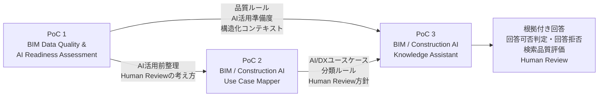

# BIM / Construction AI Portfolio Overview

## 1. Portfolioの概要

このPortfolioは、BIM導入支援・Revitコンサルティングの実務経験をベースに、建設業界におけるAI・データ活用を検証した3つの個人PoCをまとめたものです。

単にAIツールを利用するのではなく、BIMデータや建設業務をAI活用へ接続するために必要な、以下の工程を一連の流れとして整理しています。

```text
BIMデータを評価する
↓
AI活用前のデータ品質と準備度を確認する
↓
建設業務を分類する
↓
AI・RAG・自動化・BIの適用候補を整理する
↓
知識を検索可能な形に構造化する
↓
根拠付きで回答する
↓
高リスク・根拠不足の場合は回答を拒否する
↓
検索品質と回答可否を定量評価する
↓
Human Reviewへつなぐ
```

このPortfolioでは、BIMの専門知識だけではなく、業務整理、データ設計、AI適用判断、検索・回答、安全設計、定量評価までを一連で設計できることを示しています。

---

## 2. Portfolio全体の構成

### PoC 1

```text
BIM Data Quality & AI Readiness Assessment
```

BIMデータの品質を確認し、AI・データ分析へ利用できる状態かを評価します。

### PoC 2

```text
BIM / Construction AI Use Case Mapper
```

BIM・建設業務を整理し、AI、RAG、自動化、BI、Human Reviewなどの適用候補へ分類します。

### PoC 3

```text
BIM / Construction AI Knowledge Assistant
```

PoC 1・PoC 2・PoC 3の知識を検索可能な形へ統合し、根拠付き回答、回答拒否、検索品質評価を行います。

---

## 3. Portfolio Map



---

## 4. PoC一覧

| PoC   | タイトル                                       | 主な目的                                    | 主な技術・方式                                  |
| ----- | ------------------------------------------ | --------------------------------------- | ---------------------------------------- |
| PoC 1 | BIM Data Quality & AI Readiness Assessment | Revit/BIMデータの品質とAI活用準備度を評価する            | Python、pandas、Streamlit、pytest、pyRevit   |
| PoC 2 | BIM / Construction AI Use Case Mapper      | 建設業務をAI・RAG・自動化・BI・Human Reviewの候補へ分類する | Python、CSV、Markdown、pytest               |
| PoC 3 | BIM / Construction AI Knowledge Assistant  | ナレッジ検索、根拠付き回答、回答拒否、検索品質評価を行う            | Python、CSV、JSONL、キーワード検索、ルールベース判定、pytest |

---

## 5. 実装状態

各機能の現在の実装状態を、以下の4段階で整理しています。

| 状態 | 定義 |
| --- | --- |
| Implemented | コードがあり、実行・テスト可能 |
| Prototype | 限定的なMVP、教師データ設計、または初期検証まで実施 |
| Design Only | 設計文書や構成案のみ。動作する実装は未作成 |
| Planned | 今後の成果物で実装予定 |

| 項目 | 状態 | 対応PoC | 補足 |
| --- | --- | --- | --- |
| BIM品質ルールチェック | Implemented | PoC 1 | RuleIdベースで品質違反を判定 |
| AI Readiness評価 | Implemented | PoC 1 | 独自ヒューリスティック指標として実装 |
| FixPriority教師データ・ラベル設計 | Prototype | PoC 1 | 機械学習モデルは未実装 |
| AI/DXユースケース分類 | Implemented | PoC 2 | RAG、BI、自動化、Human Reviewなどへ分類 |
| Human Review設計 | Implemented | PoC 1・2・3 | 各PoCで人間確認条件を明示 |
| RAG-style Knowledge Document設計 | Implemented | PoC 3 | CSVからJSONLへ変換 |
| キーワード検索 | Implemented | PoC 3 | ローカルの簡易検索Baseline |
| 参照元付き回答 | Implemented | PoC 3 | テンプレートベースで生成 |
| 回答可否判定・回答拒否 | Implemented | PoC 3 | 高リスク・根拠不足を拒否 |
| 検索品質・No-answer評価 | Implemented | PoC 3 | Recall@3、MRR、No-answer指標を使用 |
| Azure AI Search | Design Only | PoC 3 | 設計・拡張候補のみ |
| FixPriority機械学習モデル | Planned | PoC 4 | BIM品質レビュー優先度判定を想定 |
| FastAPI | Planned | PoC 4 | 推論APIとして提供予定 |
| 機械学習モデルの精度評価 | Planned | PoC 4 | 分類指標・誤分類分析を予定 |

### 5.1 PoC 4の位置づけ

PoC 4は、次期成果物として計画している以下のプロジェクトです。

```text
BIM Quality Review Priority Triage ML & API
```

主な予定内容は以下です。

* BIM品質レビュー対象の優先度判定
* 教師データ・特徴量設計
* 機械学習モデル構築
* 精度評価
* 誤分類分析
* Human Review条件の設計
* FastAPIによる推論API化

現時点では`Planned`であり、実装済みではありません。


---

## 6. PoC 1：BIM Data Quality & AI Readiness Assessment

### 6.1 背景

BIMモデルやRevit集計表のデータは、そのままAI、データ分析、BI、RAGなどへ利用できるとは限りません。

入力値の欠損、表記揺れ、分類の不統一、必要項目の不足などがある場合、後工程での分析やAI活用に影響します。

そこでPoC 1では、BIMデータをAIへ接続する前段階として、データ品質とAI活用準備度を評価する仕組みを作成しました。

---

### 6.2 目的

主な目的は以下です。

* 必須項目が入力されているか確認する
* データの欠損や不整合を検出する
* BIMデータ品質ルールを明文化する
* RuleId単位で品質違反を記録する
* データ品質をスコア化する
* 修正優先度判断の初期設計を作成する
* AI・データ分析へ利用できる状態かを評価する
* 生成AIへ渡す構造化コンテキストを作成する
* 人間による確認が必要な項目を明示する

---

### 6.3 主な実装

* Revit集計表TXTの読み込み
* TXTからCSVへの変換
* データクレンジング
* RuleIdベースの品質チェック
* QualityScore算出
* 特徴量データセット作成
* FixPriority教師データ・ラベル設計
* AI Readiness Score算出
* AI向け構造化コンテキスト生成
* Fix Guide Markdown生成
* Streamlitによる簡易可視化
* pytestによる検証
* Roomルールの追加
* pyRevitからのElementId・UniqueId出力検証
* RAG接続を想定した設計文書作成

---

### 6.4 技術的なポイント

このPoCで重視しているのは、AIモデルそのものではなく、AIが利用できるデータ状態を作ることです。

AI Readiness Scoreは、業界標準や学習済みモデルによる推論結果ではありません。BIMデータの下流利用可能性を説明するために、品質ルールとペナルティを組み合わせて設計した、PoC独自のヒューリスティック指標です。

FixPriorityについては、現時点では機械学習モデルを実装していません。将来の優先度分類モデル構築に向けた教師データ・ラベル設計として位置づけています。

特に以下を意識しています。

* BIMデータ品質ルールの明文化
* RuleIdによる評価根拠の追跡
* 欠損・不整合の機械的検出
* 品質スコアと修正優先度の分離
* AI活用前のデータ準備度評価
* Human Reviewが必要な項目の明示
* BIM要素をElementId・UniqueIdで追跡する設計

---

### 6.5 GitHub

[PoC 1のGitHubリポジトリを見る](https://github.com/takahashi-365/bim-quality-poc)

---

## 7. PoC 2：BIM / Construction AI Use Case Mapper

### 7.1 背景

建設業務へAIを適用する場合、すべての業務を生成AIや自動化の対象にできるわけではありません。

業務によっては、RAG、BI、ルールベースチェック、自動化、人間レビューなど、適切な方式が異なります。

また、法令、契約、安全、設計判断などを含む業務では、AIだけで最終判断させるべきではありません。

そこでPoC 2では、BIM・建設業務をAI/DX活用候補として分類し、導入前の協議材料を生成する仕組みを作成しました。

---

### 7.2 目的

* BIM・建設業務を構造化して整理する
* 入力データと出力データを明確にする
* 判断を伴う業務かを確認する
* データの構造化度を整理する
* 業務リスクを整理する
* RAG適用候補を抽出する
* BI・可視化候補を抽出する
* 自動化候補を抽出する
* ルールベースチェック候補を抽出する
* Human Review対象を抽出する
* 深掘り検討対象を抽出する
* AI/DX導入前の協議材料を生成する

---

### 7.3 主な実装

* 建設業務ユースケースのサンプルデータ作成
* 業務内容、入力、出力の整理
* 判断種別の整理
* リスク分類
* データ構造化度の整理
* RecommendedApproachの付与
* HumanReviewRequiredの付与
* DeepDiveRequiredの付与
* AI活用候補の分類
* RAG候補CSVの生成
* Automation候補CSVの生成
* BI候補CSVの生成
* Human Review候補CSVの生成
* Deep Dive候補CSVの生成
* 協議用レポート生成
* 方針・制約文書の作成
* pytestによる検証

---

### 7.4 技術的なポイント

PoC 2では、「AIでできるか」だけではなく、「どの方式が適切か」「どこに人間判断が必要か」を整理しています。

主な分類対象は以下です。

```text
AI
RAG
Automation
BI
Rule-based Check
Human Review
Deep Dive
```

この分類により、AI導入の可否を単純に二択で決めるのではなく、適用方法や検討課題を整理できます。

また、AIが最終判断を行わない前提で、Human Reviewの必要性を明示しています。

---

### 7.5 GitHub

[PoC 2のGitHubリポジトリを見る](https://github.com/takahashi-365/construction-ai-use-case-mapper)

---

## 8. PoC 3：BIM / Construction AI Knowledge Assistant

### 8.1 背景

PoC 1とPoC 2では、BIMデータ品質ルール、AI Readiness、建設AI/DXユースケース、Human Review方針などの知識を作成しました。

ただし、これらがCSVやMarkdownなどの個別ファイルとして分散したままでは、必要な情報を探し、根拠を確認しながら説明することが難しくなります。

そこでPoC 3では、PoC 1・PoC 2の知識に加えて、PoC 3自身の回答方針、Human Review方針、制約を検索対象へ追加し、RAG-style Knowledge Documentsとして統合しました。

---

### 8.2 目的

PoC 3の主な目的は以下です。

* PoC 1・PoC 2・PoC 3の知識を検索可能にする
* 質問に関連する文書をTop 3で取得する
* 参照元を示した回答を生成する
* 回答できる質問かを判定する
* 高リスク質問には回答しない
* 根拠不足質問には回答しない
* 回答拒否時にHuman Reviewへつなぐ
* Ground Truthを使って検索品質を評価する
* 回答可否判定の性能を評価する
* 検索失敗を記録し、改善対象を明確にする

---

### 8.3 ナレッジ構成

現在のKnowledge Documentsは42件です。

| ナレッジ種別          |  件数 |
| --------------- | --: |
| PoC 1 Documents | 16件 |
| PoC 2 Documents | 22件 |
| PoC 3 Documents |  4件 |
| 合計              | 42件 |

PoC 3自身の知識として、以下の4文書を追加しています。

| DocumentId  | 内容             |
| ----------- | -------------- |
| P3-SUM-W001 | PoC 3のワークフロー概要 |
| P3-POL-A001 | 回答方針           |
| P3-POL-H001 | Human Review方針 |
| P3-LIM-L001 | 制約事項           |

---

### 8.4 主な実装

* PoC 1・PoC 2・PoC 3のナレッジCSV作成
* CSVからRAG-style Knowledge Documentsを生成
* JSONL形式での文書出力
* chunk設計
* metadata設計
* RuleId・UseCaseIdの付与
* HumanReviewRequiredの付与
* DeepDiveRequiredの付与
* 簡易キーワードインデックス作成
* 40問に対するTop 3検索
* 検索結果CSV生成
* Ground Truthデータセット作成
* Recall@3算出
* MRR算出
* 回答可否判定
* 高リスク質問の回答拒否
* 根拠不足質問の回答拒否
* 参照元付き回答Markdown生成
* 評価集計JSON生成
* 質問別評価CSV生成
* 検索エラー分析
* pytestによる126件の検証

---

### 8.5 処理フロー

```text
PoC 1 Knowledge CSV
PoC 2 Knowledge CSV
PoC 3 Knowledge CSV
↓
RAG-style Knowledge Documents
↓
Keyword Index
↓
Top 3 Retrieval
↓
Answerability Check
↓
Grounded Answer
または
Answer Refusal
↓
Retrieval Evaluation
↓
Human Review
```

実行順序は以下です。

```powershell
python src/build_rag_documents.py
python src/build_rag_index.py
python src/retrieve_knowledge.py
python src/evaluate_retrieval.py
python src/generate_sample_answers.py
python -m pytest -v
```

---

### 8.6 サンプル質問

サンプル質問は40問です。

| 質問種別                 |  件数 |
| -------------------- | --: |
| Answerable Questions | 35問 |
| No-answer Questions  |  5問 |
| 合計                   | 40問 |

回答拒否評価のため、以下の5種類の質問を追加しています。

| QuestionId | 対象                |
| ---------- | ----------------- |
| Q036       | 法令適合性の最終判断        |
| Q037       | 構造計算・構造安全性の最終判断   |
| Q038       | 施工方法・施工安全性の最終判断   |
| Q039       | 契約責任の決定           |
| Q040       | ナレッジに登録されていない設備仕様 |

---

### 8.7 回答拒否設計

PoC 3では、検索結果が取得できた場合でも、すべての質問へ回答するわけではありません。

以下の場合は通常回答を生成せず、Human Reviewを要求します。

#### 高リスク領域

* 法令適合性の最終判断
* 構造安全性の最終判断
* 施工方法・施工安全性の最終判断
* 契約責任の決定

#### 根拠不足

* 必要な情報がKnowledge Documentsに存在しない
* 取得した文書が質問への回答根拠として不十分

内部的には、主に以下のステータスで区別しています。

```text
NO_ANSWER_HIGH_RISK
NO_ANSWER_NO_EVIDENCE
```

回答拒否時は、以下を設定します。

```text
HumanReviewRequired：True
```

この設計により、AIに回答させる仕組みだけではなく、AIに回答させない条件と人間への引継ぎを明文化しています。

---

### 8.8 検索品質評価

検索評価では、質問ごとに期待文書を定義したGround Truthを作成しています。

使用している主な指標は以下です。

#### Recall@3

期待文書がTop 3以内に取得できた質問の割合です。

#### MRR

期待文書が検索結果の何位に取得されたかを評価する指標です。

1位に取得されるほど高い値になります。

---

### 8.9 回答可否評価

回答可否判定では、以下の指標を使用しています。

#### Answerability Accuracy

回答可能・回答拒否の判定が正しかった割合です。

#### No-answer Precision

回答拒否と判定した質問のうち、実際に回答拒否対象だった割合です。

#### No-answer Recall

回答拒否対象の質問を、どの程度漏れなく回答拒否できたかを示します。

---

### 8.10 評価結果

| 評価項目                   |         結果 |
| ---------------------- | ---------: |
| Knowledge Documents    |        42件 |
| Sample Questions       |        40問 |
| Answerable Questions   |        35問 |
| No-answer Questions    |         5問 |
| Recall@3               |     0.9714 |
| MRR                    |     0.9190 |
| Answerability Accuracy |     1.0000 |
| No-answer Precision    |     1.0000 |
| No-answer Recall       |     1.0000 |
| pytest                 | 126 passed |

回答可能質問35問のうち34問では、期待文書をTop 3以内に取得できました。

回答拒否対象の5問については、すべて想定どおり回答拒否となりました。

---

### 8.11 既知の検索失敗

現在のBaselineでは、1件の検索失敗があります。

```text
QuestionId：Q027
ExpectedDocumentId：P3-SUM-W001
```

実際のTop 3は以下です。

```text
1. P2-SUM-W001
2. P2-USECASE-UC010
3. P2-USECASE-UC003
```

期待文書である`P3-SUM-W001`をTop 3以内に取得できませんでした。

この問題に対し、特定質問だけに適合する検索ルールは追加していません。

質問固有の修正を行うと、評価データに過度に適合した実装になる可能性があるためです。

現在は、簡易キーワード検索のBaseline制約として記録し、以下の改善候補へつなげています。

* 検索対象テキストの再設計
* トークン正規化の改善
* BM25との比較
* Embedding検索との比較
* Hybrid Searchとの比較

この結果を隠さず記録することで、単に成功結果を示すだけではなく、評価・分析・改善のサイクルを示しています。

---

### 8.12 技術的な位置づけ

PoC 3は、本番環境のLLMベースRAGではありません。

現在の構成は以下です。

```text
ローカルPython
CSV
JSONL
JSON
簡易キーワード検索
テンプレートベース回答
ルールベース回答可否判定
Ground Truth評価
pytest
```

以下は使用していません。

```text
OpenAI API
Azure OpenAI
Azure AI Search
Embedding
ベクトルデータベース
クラウドAI
LLMによる自由生成
```

したがって、PoC 3は以下のように位置づけています。

```text
RAG-style Knowledge Assistant
```

または、

```text
RAG-ready Knowledge Assistant
```

本PoCで検証したのは、高度なRAGシステムそのものではなく、RAGへ接続可能なナレッジ構造、検索、回答、安全設計、評価フローです。

---

### 8.13 GitHub

[PoC 3のGitHubリポジトリを見る](https://github.com/takahashi-365/bim-construction-ai-knowledge-assistant)

---

## 9. 3つのPoCで示した能力

### 9.1 BIM実務を理解したデータ設計

BIMデータの品質、欠損、不整合、修正優先度、要素識別情報を整理し、AI・データ分析へ接続する前段階を設計しています。

---

### 9.2 業務をAI活用候補へ分解する能力

建設業務を単に自動化候補とするのではなく、RAG、BI、自動化、ルールベースチェック、Human Reviewなどへ分類しています。

---

### 9.3 ナレッジ構造を設計する能力

CSV、JSONL、metadata、RuleId、UseCaseIdなどを用いて、複数PoCの知識を検索可能な構造へ変換しています。

---

### 9.4 根拠付き回答を設計する能力

検索結果と参照元を回答へ含め、どの文書を根拠にしているか確認できる形にしています。

---

### 9.5 AIに回答させない条件を設計する能力

法令、構造、施工安全、契約責任、根拠不足など、AIだけで最終判断させるべきでない領域を回答拒否対象としています。

---

### 9.6 Human Reviewを組み込む能力

AI処理だけで完結させず、人間確認が必要な条件を明文化し、HumanReviewRequiredとしてデータへ反映しています。

---

### 9.7 PoCを定量評価する能力

Ground Truth、Recall@3、MRR、Answerability Accuracy、No-answer Precision、No-answer Recallを用いて、検索と回答可否判定を評価しています。

---

### 9.8 失敗を分析し、次の改善へつなげる能力

検索失敗を削除・隠蔽せず、エラー分析として記録し、検索方式の改善候補へつなげています。

---

### 9.9 GitHub上で再現可能な成果物を作る能力

README、設計文書、input、output、src、testsを整理し、実装と検証結果を第三者が確認できる形で公開しています。

---

## 10. 実装済みの範囲

* BIMデータ品質評価
* AI Readiness評価
* RuleIdベースの品質チェック
* FixPriority教師データ・ラベル設計
* AI向け構造化コンテキスト生成
* BIM・建設業務ユースケース分類
* RAG・BI・Automation候補抽出
* Human Review対象判定
* RAG-style Knowledge Document設計
* metadata設計
* ローカルキーワード検索
* Top 3検索
* 参照元付き回答
* 回答可否判定
* 高リスク質問の回答拒否
* 根拠不足質問の回答拒否
* Ground Truth作成
* Recall@3・MRR評価
* Answerability評価
* No-answer Precision・Recall評価
* 検索エラー分析
* pytestによる検証
* pyRevit出力検証
* Streamlitによる簡易可視化

---

## 11. 未実装の範囲

以下は現時点では未実装です。

* PoC 4のFixPriority機械学習モデル
* PoC 4のFastAPI
* PoC 4の機械学習モデル精度評価

* OpenAI APIを用いた回答生成
* Azure OpenAIを用いた回答生成
* Azure AI Search
* Embedding検索
* ベクトルデータベース
* BM25検索
* Hybrid Search
* LLMによる自由生成
* AIエージェント
* 自律的な業務実行
* 本番環境へのデプロイ
* 実務利用者向け認証・権限管理
* 本番運用監視
* 実務データによる大規模評価

この区別により、実装済みの範囲を過大表現しないようにしています。

---

## 12. 今後の拡張方針

### 短期

* ダイスネクスト求人対応型One-Pager作成
* 求人応募開始
* PoC 4：BIM Quality Review Priority Triage ML & APIの着手
* Portfolio PDF作成
* 面接説明用One-Pager作成
* GitHubプロフィールへのPinned設定
* Streamlit UIの追加検討
* READMEとPortfolio資料の表現統一

### 中期

* COBie・FMナレッジ追加
* BIM実行計画・BEP関連ナレッジ追加
* BM25検索との比較
* Embedding検索との比較
* Hybrid Searchとの比較
* Power BI可視化との接続

### 長期

* Azure AI Searchとの接続
* Azure OpenAIによる回答生成
* pyRevit・Revit API連携強化
* 実務データを用いたナレッジ拡張
* 実務利用を想定した権限・監査設計
* 評価データセットの拡張

---

## 13. 使用技術

* Revit
* BIM
* Python
* pandas
* CSV
* JSON
* JSONL
* Markdown
* Streamlit
* pytest
* Mermaid
* Git
* GitHub
* Power BI
* pyRevit
* Revit API

---

## 14. 面接向け説明文

BIM導入支援・Revitコンサルティングの実務経験をもとに、BIMデータと建設業務をAI活用へ接続するための3つのPoCを作成しました。

PoC 1では、BIMデータの品質とAI活用準備度を評価する仕組みを作成しました。

PoC 2では、建設業務をAI、RAG、自動化、BI、Human Reviewなどの活用候補へ分類しました。

PoC 3では、これらの知識を検索可能な形へ統合し、根拠付き回答、回答可否判定、高リスク・根拠不足時の回答拒否、Ground Truthによる検索品質評価までを実装しました。

検索できるだけではなく、正しい文書を取得できたかをRecall@3とMRRで評価し、AIが回答してはいけない質問を正しく拒否できたかも評価しています。

また、検索に失敗した質問を隠さずエラー分析として記録し、BM25、Embedding、Hybrid Searchなどへの改善余地として整理しました。

これらを通じて、BIM実務、業務整理、データ設計、AI適用判断、検索・回答、安全設計、定量評価、Human Reviewまでを一連で設計できることを示しています。

次期成果物として、BIM品質レビュー対象の優先度を機械学習で判定し、FastAPIで提供するPoC 4を計画しています。PoC 4は現時点では未実装です。

---

## 15. 職務経歴書向け要約

BIM・Revitコンサルティング経験を基に、BIMデータ品質評価、AI活用準備度評価、建設業務のAI/DXユースケース分類、RAG-styleナレッジ設計を行う個人PoCを開発。

PoC 3では、42件のKnowledge Documentsと40問の評価データを用い、簡易キーワード検索、参照元付き回答、回答可否判定、高リスク・根拠不足時の回答拒否を実装。

Ground Truthを用いてRecall@3 0.9714、MRR 0.9190、Answerability Accuracy 1.0000、No-answer Precision 1.0000、No-answer Recall 1.0000を確認し、pytest 126件を通過。

AIへ回答させるだけでなく、回答拒否、Human Review、検索エラー分析まで含めた安全・評価設計を実施。

---

## 16. GitHubリポジトリ

### PoC 1

[BIM Data Quality & AI Readiness Assessment](https://github.com/takahashi-365/bim-quality-poc)

### PoC 2

[BIM / Construction AI Use Case Mapper](https://github.com/takahashi-365/construction-ai-use-case-mapper)

### PoC 3

[BIM / Construction AI Knowledge Assistant](https://github.com/takahashi-365/bim-construction-ai-knowledge-assistant)
